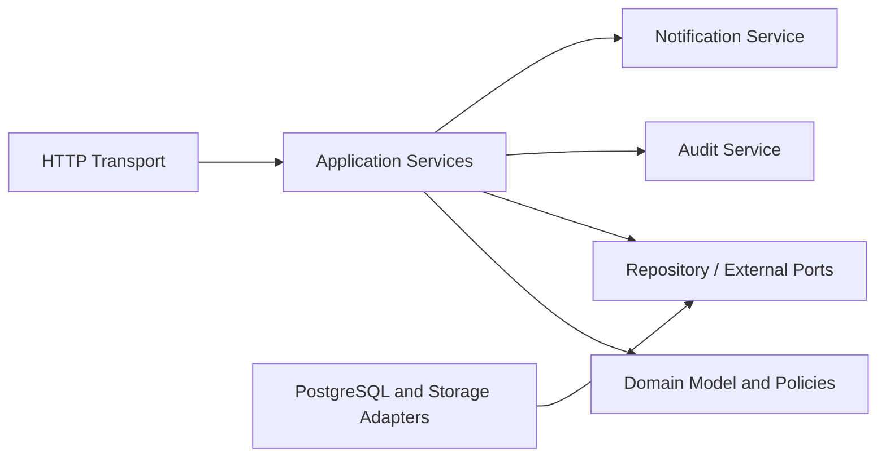
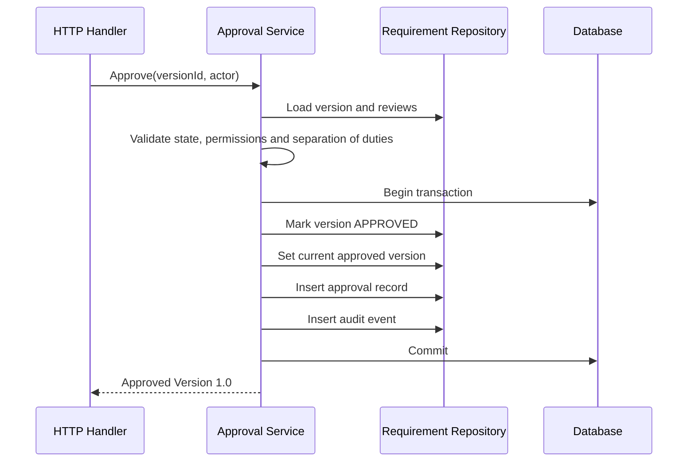

# TeamFlow Component Architecture

## Backend Components



## Domain Modules

```text
identity
projects
requirements
approvals
clarifications
change_requests
planning
quality
releases
reporting
notifications
audit
```

Each module contains:

```text
domain/       entities, value objects, policies and domain errors
application/  commands, queries and transaction orchestration
repository/   interfaces and PostgreSQL adapters
transport/    HTTP handlers and request mapping
dto/          API request and response contracts
```

## Dependency Rules

1. Domain packages do not import Gin, SQL drivers or HTTP DTOs.
2. Transport calls application services; it does not contain business rules.
3. Application services depend on repository interfaces.
4. PostgreSQL adapters implement repository interfaces.
5. Cross-module writes occur through application services, not direct repository access.
6. Every critical state transition and its audit event share one transaction.

## Cross-Cutting Platform Components

- Configuration and environment validation
- Structured logging and trace IDs
- Authentication and authorization middleware
- Database transaction manager
- Validation and standard API errors
- Clock and identifier providers for deterministic tests
- Attachment security
- Observability and health endpoints

## Requirement Approval Transaction



## Frontend Components

The Angular application uses domain folders with `pages`, `components`, `data-access`, `models`, and route definitions. Signals may hold local feature state; server data remains authoritative.
