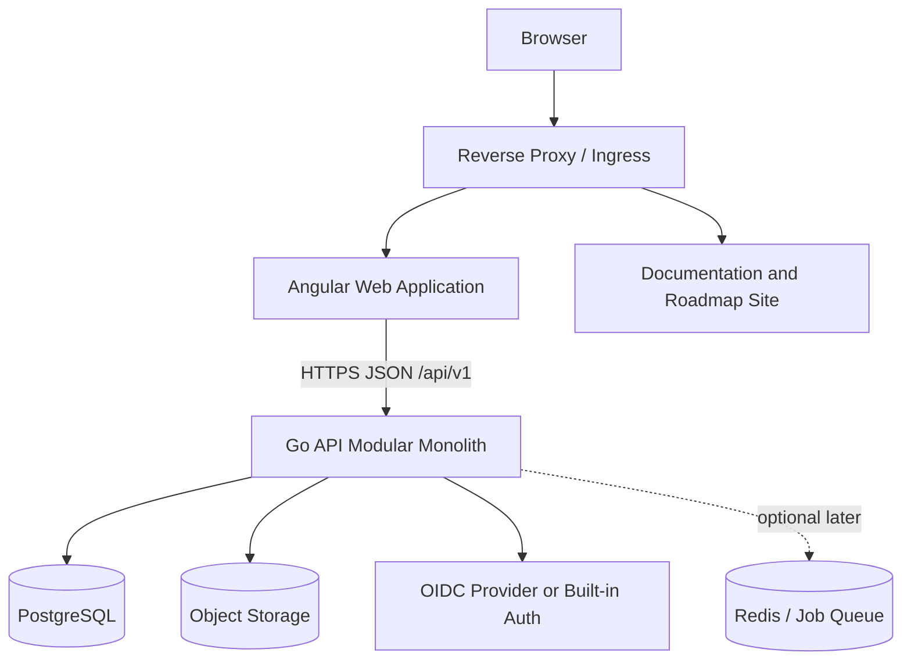

# TeamFlow Container Architecture

## Recommended Architecture

TeamFlow starts as a modular monolith with independently deployable web and API containers.



## Containers

### Angular Web Application

Provides authenticated role-based operational screens. It contains no authoritative authorization decisions.

### Documentation and Roadmap Site

Public product documentation and content-driven visual roadmap. It does not expose operational project data.

### Go API

Owns domain rules, authorization, transactions, workflow transitions, audit events and all persistence access.

### PostgreSQL

Stores identities when built-in auth is used, projects, requirements, versions, approvals, change requests, tasks, QA records, releases and audit events.

### Object Storage

Stores binary attachments using generated storage keys and checksum metadata.

## Deployment Paths

```text
/                Angular web
/api/*           Go API
/documentation/* Documentation site
/roadmap          Roadmap visualiser
```

## Initial Deployment

Local development runs Angular and Go natively and PostgreSQL through an OCI-compatible container. Kubernetes is deferred until the product is stable enough for an internal pilot.

## Scaling

The API remains stateless. Additional API instances may be added behind the reverse proxy. Database scaling and asynchronous jobs are introduced only when measured demand requires them.
