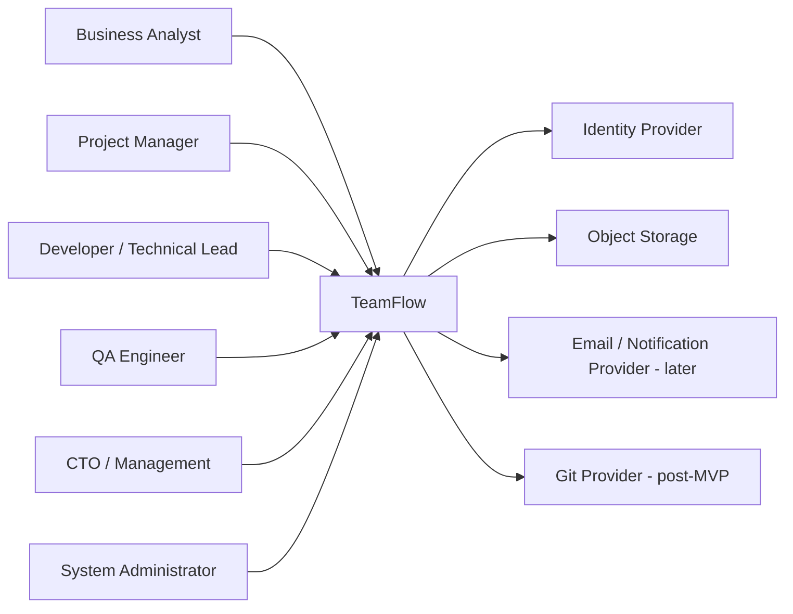

# TeamFlow System Context

## Purpose

TeamFlow is an internal requirement-governance and delivery-assurance platform. It establishes a single source of truth from business requirement through planning, implementation, QA, acceptance and release.

## People

- Business Analyst: authors requirements, clarifies intent and performs business acceptance.
- Project Manager: plans approved work and records schedule impact.
- Developer and Technical Lead: assess feasibility, implement tasks and record technical evidence.
- QA Engineer: creates version-linked tests, executes them and manages defects.
- CTO and Management: review risk, approve high-impact changes and release decisions.
- System Administrator: manages identities and configuration without receiving implicit business approval authority.

## System Boundary

## External Systems

### Identity Provider

The MVP may use built-in JWT authentication, but the architecture keeps authentication replaceable with Keycloak or another OpenID Connect provider.

### Object Storage

Stores requirement attachments, test evidence and release artifacts. Local development may use filesystem or an S3-compatible service.

### Notification Provider

In-application notifications are MVP scope. Email integration is optional and must be behind an adapter.

### Source Control Provider

GitHub/GitLab integration is post-MVP. Core workflows must not depend on it.

## Core Outcomes

- Approved requirement versions are immutable.
- Post-approval changes require a change request.
- Tasks and test cases reference exact requirement versions.
- Every important decision is auditable.
- Management can see change-related effort and delivery impact.
